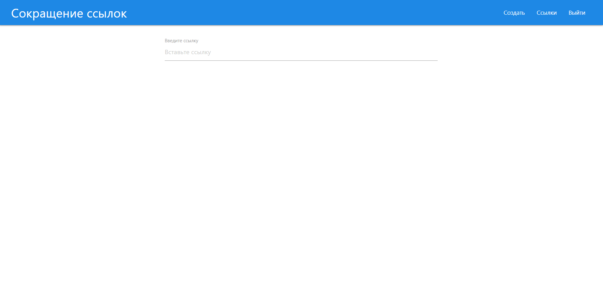

# Link shortening 

This is educational project to lear fullstack development using Express, React JS and MySQL DB.

## Overview

### Screenshot





## My process

### Built with

- Semantic HTML5 markup
- CSS custom properties
- [React](https://reactjs.org/) - JS library
- [Express](https://expressjs.com/) - JS Framework
- MySQL database

## Run

To run this app use:

```npm run dev```

## Author

- Telegram - [@Keberson](https://www.t.me/Keberson)
